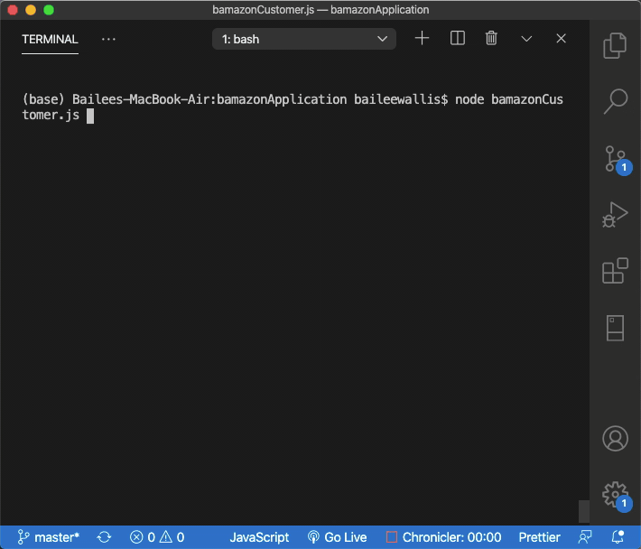
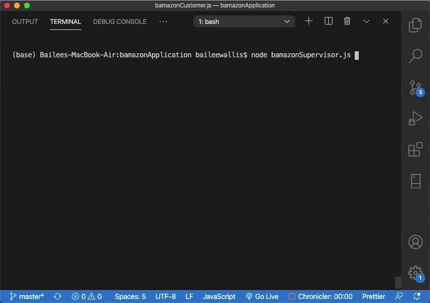

# bamazonApplication
A very clever play on an unknown online retailer using Node.js, MySQL, and Inquirer.

*Goal of this application*
- Utilize MySQL to create a CLI application
- Mimic functionality of an online retailer
- Allow different views to impact the database and other views
- Utilize CRUD actions, primary and foreign keys, and joins

*Future developments*
- Include an 'exit' option for the customer view
- Create a matching prototype for each view

*Skills utilized* 
- MySQL connected to Node.JS
- CRUD actions
- Primary and foreign keys
- Joins
- Inquirer
- Node.js

#### Customer View
Using the command line, customers can view all products for sale and purchase those currently available by selecting an item name and a quantity to purchase. If there is enough of the specified product in stock, the customer's total price is calculated. The quantity of product remaining is also displayed. If the user selects an amount for purchase greater than the number in stock, they will be alerted that there is an insufficient quantity.
 
[Bamazon Customer YouTube Demo](https://www.youtube.com/watch?v=EL20Kvpa8Vs) 

#### Manager View
Managers have four options: they can view products for sale, view low inventory, add to inventory, or add a new product.   If they select 'View Products for Sale', all products (including ID, name, department name, price, quantity in stock, and the calculated product sales) are displayed.   If 'View Low Inventory' is selected, the manager is shown which products have less than five available for purchase. If all products are sufficently stocked, an alert will be displayed. This inventory updates when a customer purchases items, bringing the inventory level below five.   If 'Add to Inventory' is selected, products can be restocked.   Finally, if 'Add New Product' is selected, managers can add a product name, its price, and what department it belongs to. This addition will appear for customers and supervisors.
 
[Bamazon Manager YouTube Demo](https://www.youtube.com/watch?v=jGtx6yq9e8Q) 

#### Supervisor View
Supervisors have the option to view product sales by department or create a new department. If 'View Product Sales by Department' is selected, a table is rendered, displaying the department ID, name, its product sales, overhead costs, and total profit. These numbers are dynamically calculated based on the action of the manager and what products are added to each department. When a department is intially created, supervisors have the option to set the department name, and its costs. As no products are automatically added to the department, its product sales are $0 and its total profit is negative.
 
[Bamazon Supervisor YouTube Demo](https://www.youtube.com/watch?v=Tqv_PEmEsNw)
